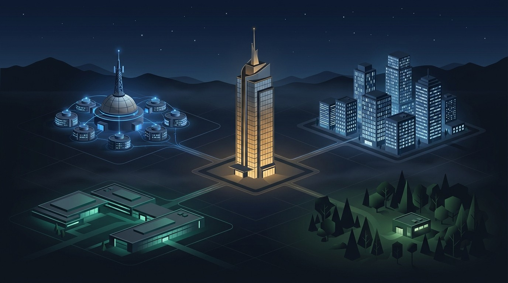
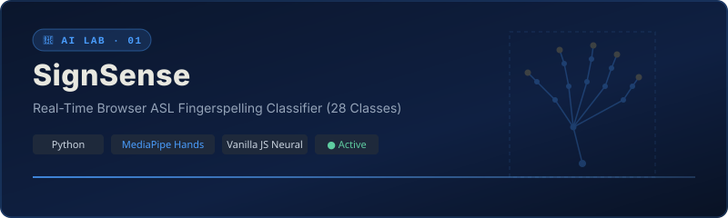
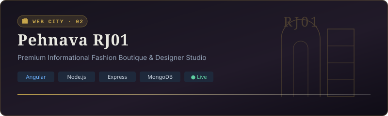
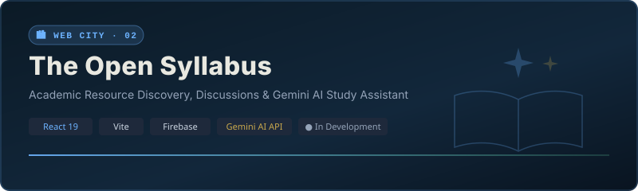

<picture>
  <source media="(prefers-color-scheme: dark)" srcset="assets/world/saksham-world-dark.jpg">
  <source media="(prefers-color-scheme: light)" srcset="assets/world/saksham-world-light.jpg">
  
</picture>

<div align="center">

<br/>


<br/><br/>

**`AI × SOFTWARE × DESIGN`**

<br/>

*Everything here was built, broken, learned, or rebuilt.*

<br/>

[ **AI LAB** ](#-ai-lab) &nbsp;·&nbsp; [ **WEB CITY** ](#-web-city) &nbsp;·&nbsp; [ **MOBILE** ](#-mobile-district) &nbsp;·&nbsp; [ **EXPERIMENTS** ](#-experiment-forest)

</div>

<br/>

---

## ◈ VISUAL PROJECT LANDMARKS

<br/>

### 🔬 SignSense — AI LAB

<a href="https://sign-sense-six.vercel.app/"></a>

> Browser-based ASL fingerspelling classifier recognizing 28 static gesture classes from A–Z plus SPACE, DELETE, and NOTHING using MediaPipe Hands and a custom in-browser neural network.

<div align="center">

[ **`◈ View Repository`** ](https://github.com/Saksham1105/SignSense) &nbsp;&nbsp;&nbsp;&nbsp; [ **`▶ Open Live Demo`** ](https://sign-sense-six.vercel.app/)

</div>

<br/>

---

### 🏙 Pehnava RJ01 — WEB CITY

<a href="https://pehnava.mazrik.in/"></a>

> Premium informational fashion boutique website showcasing designer collections with a refined, editorial MEAN-stack architecture.

<div align="center">

[ **`◈ View Repository`** ](https://github.com/Saksham1105/Pehnava---Mean-Stack) &nbsp;&nbsp;&nbsp;&nbsp; [ **`▶ Visit Pehnava`** ](https://pehnava.mazrik.in/)

</div>

<br/>

---

### 📚 The Open Syllabus — WEB CITY

<a href="https://github.com/Saksham1105/The-Open-Syllabus"></a>

> Student-focused course-resource and discussion platform with an integrated Gemini-powered AI study assistant.

<div align="center">

[ **`◈ View Repository`** ](https://github.com/Saksham1105/The-Open-Syllabus)

</div>

<br/>

---

## ◈ DISTRICTS

<details>
<summary><strong>🔬 AI LAB — SignSense</strong></summary>

Computer vision and neural network research zone. Home of **SignSense** (in-browser ASL gesture classification).
[Repository](https://github.com/Saksham1105/SignSense) · [Live Demo](https://sign-sense-six.vercel.app/)

</details>

<details>
<summary><strong>🏙 WEB CITY — Pehnava RJ01 &amp; The Open Syllabus</strong></summary>

Full-stack product district. Home of **Pehnava RJ01** (boutique site) and **The Open Syllabus** (academic resource platform).
Pehnava: [Repo](https://github.com/Saksham1105/Pehnava---Mean-Stack) · [Live](https://pehnava.mazrik.in/) | Open Syllabus: [Repo](https://github.com/Saksham1105/The-Open-Syllabus)

</details>

<details>
<summary><strong>📱 MOBILE DISTRICT — GymPro</strong></summary>

Android mobile development zone. **GymPro** `[ PRIVATE · INTERNAL ]`.

</details>

<details>
<summary><strong>🌲 EXPERIMENT FOREST — Foundations &amp; Coursework</strong></summary>

Prototypes and fundamental work: C/C++, Operating Systems, Compiler Design, Analysis of Algorithms, and Project Management tools.

</details>

<details>
<summary><strong>🔒 PRIVATE WING — Restricted Facilities</strong></summary>

`[ NAMO-WEBSITE · RESTRICTED ]` &nbsp;·&nbsp; `[ AI-AGENCY-PORTFOLIO · RESTRICTED ]`

</details>

<br/>

---

## ◈ ENGINEERING JOURNEY

```
  2023 ── Foundations · C / C++ / Python · Data structures & algorithms
  2024 ── Software Development · Full-stack web · Angular, Node & MongoDB
  2025 ── AI / ML & Product Building · MediaPipe, React & Firebase
  2026 ── AI Integration & Full-Stack · Gemini API, production systems & design
  NOW  ── Still building.
```

<br/>

---

## ◈ CURRENT FOCUS

- Building AI-powered products that are actually usable by real people
- Deepening full-stack engineering — from data layer to interface
- Strengthening DSA and systems fundamentals

<br/>

---

## ◈ GITHUB SIGNAL

<div align="center">


</div>

<br/>

---

## ◈ CONTACT

<div align="center">

[ **`GitHub → @Saksham1105`** ](https://github.com/Saksham1105)

</div>

<br/>

---

<div align="center">

<sub>SAKSHAM WORLD &nbsp;·&nbsp; still building &nbsp;·&nbsp; everything here was built, broken, learned, or rebuilt</sub>

</div>
